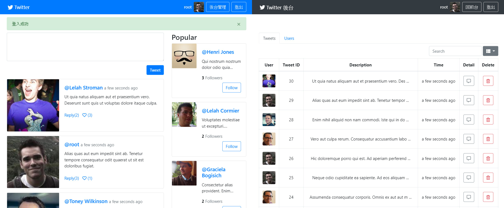

# Simple Twitter 實作

Alpha Camp 學期四期中專案，復刻 Twitter。
完成指定 [User Story](https://github.com/Lastor-Chen/simple-twitter-express-starter/wiki/User-Story-%E6%90%AC%E9%81%8B)，並通過指定之單元測試。



<br>

## ERD


<br>

## Heroku 佈署版
- [傳送門](https://burger-simple-twitter.herokuapp.com)
- 測試用帳戶：
    ```  
    email: "root@example.com",  // admin
    password: "12345678"

    email: "user1@example.com",
    password: "12345678"

    email: "user2@example.com",
    password: "12345678"

    ( user1 - user19，共 19 組)
    ```

<br>

## 本地端使用 Installation

### 安裝專案與依賴套件
package list 請參考下方 [Dependency](#Dependency)。
```
// install project
$ git clone https://github.com/Lastor-Chen/simple-twitter-express-starter.git


// install npm package
$ npm install
```

### 初始化資料庫
1. 啟動 MySQL Server
    * Mac
    ```
    1. 開啟「系統偏好設定介面」並點擊 MySQL 圖標
    2. 點擊 GUI 中的 Start MySQL Server
    ```

    * Windows (需用系統管理員執行)

    ```
    $ net start mysql80
    ```

1. 使用 MySQL GUI 工具，建立 database
    ```
    # SQL
    CREATE DATABASE `ac_twitter_workspace`;
    CREATE DATABASE `ac_twitter_workspace_test`;
    ```

1. 初始化 database
    ```
    $ npx sequelize db:migrate
    $ npx sequelize db:migrate --env test
    ```

1. 建立種子資料
    ```
    $ npx sequelize db:seed:all
    ```

1. 也可清空種子資料
    ```
    $ npx sequelize db:seed:undo:all
    ```

### 設定環境變數
本專案使用 imgur API 製作圖片上傳功能。
需在根目錄中新建 .env 檔案，設置環境變數。
```
// IMGUR 開發者API
IMGUR_CLIENT_ID = your_client_ID
```

<br>

### 本地啟動 App

- 完成上述前置動作之後，可啟動專案。
    ```
    $ npm run dev
    ```

- 確認本地 server 啟動後，即可使用瀏覽器操作本 App。
    ```
    http://localhost:3000
    ```

- 關閉本地 App
    ```
    1. 回到 cmd 按下 Ctrl + C
    2. 按 y 確認
    ```

- 關閉 MySQL Server
    - Mac
    ```
    1. 開啟「系統偏好設定介面」並點擊 MySQL 圖標
    2. 點擊 GUI 中的 Stop MySQL Server
    ```
    - Windows (需用系統管理員執行)
    ```
    $ net stop mysql80
    ```

<br>

## 單元測試
在本地測試需修改 `config/config.json` 中，sequelize 設定。
<pre>
"test": {
    <s>"username": "travis"</s>
    <b>"username": "your_username",</b>  // add
    <b>"password": "your_password",</b>  // add
    ...
}
</pre>

執行測試
- mac : `$ npm run test`
- win : `$ npm run test:win`

<br>

## Dependency
於本機端執行前，請確認是否已安裝下列內容。
### main
* [Node.js](https://nodejs.org/en/) v10.16.3
* [MySQL](https://www.mongodb.com/) v8.0.17

### npm package
[link to check package.json](./package.json)

### front-end package (已內建)
* [Bootstrap](https://getbootstrap.com/) v4.3.1
  * jQuery v3.4.1
  * popper v1.14.7

<br>

## Install Dependency

#### Install Node.js
本機端必須安裝 Node.js 與相關 package 才能執行此專案。 <br>
如尚未安裝 Node.js，建議使用 nvm toolkit 下載指定版本的 Node.js

| OS | URL |
| -------- | -------- |
| nvm-windows     | [Link to](https://github.com/coreybutler/nvm-windows) |
| nvm-macOS     | [Link to](https://github.com/nvm-sh/nvm) |

#### Download MySQL
本機端必須安裝 MySQL 才能執行此專案。 <br>
請連結到 MySQL 官方網站[下載](https://dev.mysql.com/downloads/mysql/)。

#### 選擇安裝 nodemon
本專案推薦使用 [nodemon](https://github.com/remy/nodemon) 來取代原生的 Node.js 啟動方法。
```
$ npm install -g nodemon
```

<br>

## Maintainers
build on 2019，by team 最終溫蒂蕃茄堡
- [Lastor](https://github.com/Lastor-Chen)
- [TomatoSoup](https://github.com/TomatoSoup0126)
- [Wendy](https://github.com/wendyhsiao)
